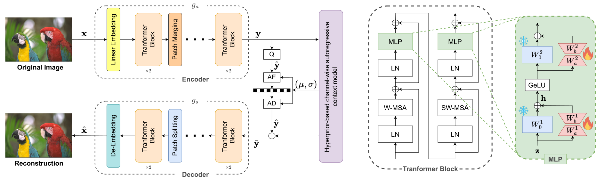
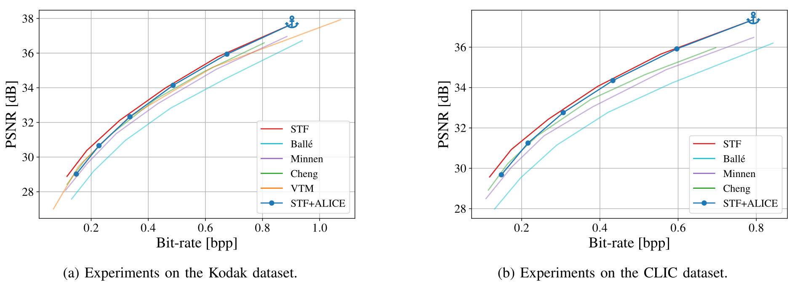
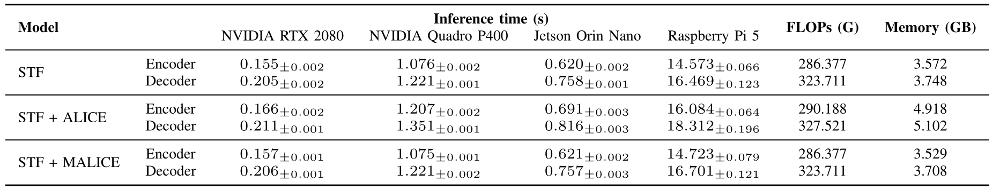

# ALICE: Adapt your Learnable Image Compression modEl for variable bitrates 

Pytorch implementation of the paper "**ALICE: Adapt your Learnable Image Compression modEl for variable bitrates**", published at VCIP 2024. This repository is based on [CompressAI](https://github.com/InterDigitalInc/CompressAI) and [STF](https://github.com/Googolxx/STF).

<div align="center">

</div>

## Abstract
When training a Learned Image Compression
model, the loss function is minimized such that the encoder and
the decoder attain a target Rate-Distorsion trade-off. Therefore, a
distinct model shall be trained and stored at the transmitter and
receiver for each target rate, fostering the quest for efficient vari-
able bitrate compression schemes. This paper proposes plugging
Low-Rank Adapters into a transformer-based pre-trained LIC
model and training them to meet different target rates. With our
method, encoding an image at a variable rate is as simple as
training the corresponding adapters and plugging them into the
frozen pre-trained model. Our experiments show performance
comparable with state-of-the-art fixed-rate LIC models at a
fraction of the training and deployment cost.

## Usage

- First download openimages dataset using `src/downloader_openimages.py`.
- For evaluation and validation during training also download KODAK dataset.

The script for downloading [OpenImages](https://github.com/openimages) is provided in `downloader_openimages.py`. Please install [fiftyone](https://github.com/voxel51/fiftyone) first.

## Environment
- conda env create -f environment.yml
- conda activate alice

## Evaluation

- Download our pretrained model in the ALICE directory from [here](https://drive.google.com/file/d/1Hz-5ODbXkSUOei807ThGSqL63Ow8ZanV/view?usp=sharing).
- Extract pretrained.zip
```
ALICE
│   README.md
│  
└───pretrained
│   └───adapt_0483_seed_42_conf_lora_8_8_opt_adam_sched_cosine_lr_0_0001
│        │   inference.json
|        |   inference_merge.json
│        │   013_checkpoint_best.pth.tar
|        |   025_checkpoint_best.pth.tar
│        │   ...
|  
│       adapt_0483_seed_42_conf_vanilla_adapt_opt_adam_sched_cosine_lr_0_0001
│        │   inference.json
│        │   013_checkpoint_best.pth.tar
|        |   025_checkpoint_best.pth.tar
│        │   ...
|  
│       stf
│        │   inference.json
│        │   stf_013_best.pth.tar
|        |   stf_025_best.pth.tar
│        │   ...   
|        |
└───src
    │   train.py
    │   ...
```

- Finally, run the following command:
```
cd src

python -m evaluate.eval --test-dir /test/to/kodak/ --file-name results_kodak --save-path /path/to/save/results
```

**To evaluate your own model** follow the same structure proposed above:
- First create a folder named `pretrained/your_model`.
- In this folder collect all of the trained models making sure that each one ends with best.pth.tar, for example:
  - `pretrained/your_model/your_model_013_best.pth.tar`
  - `pretrained/your_model/your_model_0018_best.pth.tar`
  - `pretrained/your_model/your_model_025_best.pth.tar`
  - ...
- Create a file named `pretrained/your_model/inference.json` in the same folder in this way:

```
{
    "model":"your_model",
    "checkpoints_path":"pretrained/your_model"
}
```

- You can compare multiple models at the same time creating a folder with an inference.json file and saving the chekpoints.
- List all of the model that you want to compare in the variable `configs` in the main function of `src/evaluate/eval.py`

### MALICE
You can evaluate *MALICE* including in the `configs` variable defined in the main function of `src/evaluate/eval.py` the following configuration: 
```
../pretrained/adapt_0483_seed_42_conf_lora_8_8_opt_adam_sched_cosine_lr_0_0001/inference_merge.json
```


## Train
The training script is provided in
`src/train.py`. 

### Training with LoRA:
```
cd src

python train.py --batch-size=16 --checkpoint=../pretrained/stf/stf_0483_best.pth.tar --cuda=1 --dataset=../../../data/small_openimages/ --epochs=15 --lambda=0.013 --learning-rate=0.0001 --lora=1 --lora-config=../configs/lora_8_8.yml --lora-opt=adam --lora-sched=cosine --model=stf --save=1 --save-dir=../results/adapt_models_lora/adapt_0483 --test-dir=../../../data/kodak/
```

### Finetuning Only the FC layer (Vanilla):
```
cd src

python train.py --batch-size=16 --checkpoint=../pretrained/stf/stf_0483_best.pth.tar --cuda=1 --dataset=../../../data/small_openimages/ --epochs=15 --lambda=0.013 --learning-rate=0.0001 --lora=1 --lora-opt=adam --lora-sched=cosine --model=stf --save=1 --save-dir=../results/adapt_models_vanilla/adapt_0483 --test-dir=../../../data/kodak/ --vanilla-adapt=1
```

Sweep files to adapt the model for all lambda values are saved in: 
- [sweeps/lora_adam_all_points.yaml](sweeps/lora_adam_all_points.yaml)
- [sweeps/vanilla_adam_all_points.yaml](sweeps/vanilla_adam_all_points.yaml)


## Results

- Rate-Distortion
<div align="center">

</div>

- Complexity Considerations
<div align="center">

</div>


## Pretrained Models (from STF repo)
Pretrained models (optimized for MSE) trained from scratch using randomly chose 300k images from the OpenImages dataset.

| Method | Lambda | Link                                                                                           |
| ---- |--------|---------------------------------------------------------------------------------------------------|
| STF | 0.0018 | [stf_0018](https://drive.google.com/file/d/15ujpSjif628iwVEay3mAWN-Vyqls3r23/view?usp=sharing) |
| STF | 0.0035 | [stf_0035](https://drive.google.com/file/d/1OFzZoEaofNgsimBuOPHtgOJiGsR_RS-M/view?usp=sharing)    |
| STF | 0.0067 | [stf_0067](https://drive.google.com/file/d/1SjhqcKyP3SqVm4yhJQslJ6HgY1E8FcBL/view?usp=share_link) |
| STF | 0.013  | [stf_013](https://drive.google.com/file/d/1mupv4vcs8wpNdXCPclXghliikJyYjgj-/view?usp=share_link)  |
| STF | 0.025  | [stf_025](https://drive.google.com/file/d/1rsYgEYuqSYBIA4rfvAjXtVSrjXOzkJlB/view?usp=sharing)     |
| STF | 0.0483 | [stf_0483](https://drive.google.com/file/d/1cH5cR-0VdsQqCchyN3DO62Sx0WGjv1h8/view?usp=share_link) |


## Related links
 * STF: https://github.com/Googolxx/STF
 * CompressAI: https://github.com/InterDigitalInc/CompressAI
 * Swin-Transformer: https://github.com/microsoft/Swin-Transformer
 * Tensorflow compression library by Ballé et al.: https://github.com/tensorflow/compression
 * Range Asymmetric Numeral System code from Fabian 'ryg' Giesen: https://github.com/rygorous/ryg_rans
 * Kodak Images Dataset: http://r0k.us/graphics/kodak/
 * Open Images Dataset: https://github.com/openimages
 * fiftyone: https://github.com/voxel51/fiftyone
 * CLIC: https://www.compression.cc/


